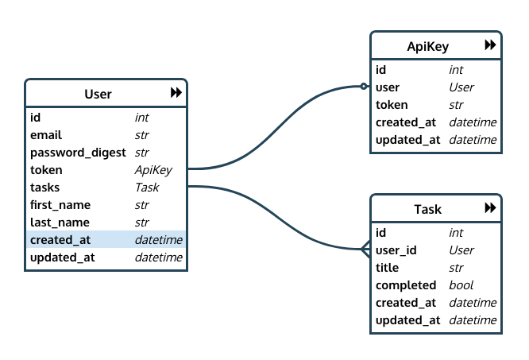

# Rails API for a Simple To-Do App

## Tasks
* `GET /api/v1/tasks`
* `GET /api/v1/tasks/:id`
* `POST /api/v1/tasks`
* `GET /api/v1/tasks/:id`
* `PUT|PATCH /api/v1/tasks/:id`
* `DELETE /api/v1/tasks/:id`

## Users
* `GET /api/v1/users`
* `POST /api/v1/users`
* `PUT|PATCH /api/v1/users/:id`
* `DELETE /api/v1/users/:id`

## Sessions
* `POST /api/v1/sessions`

## ER Diagram of Models
